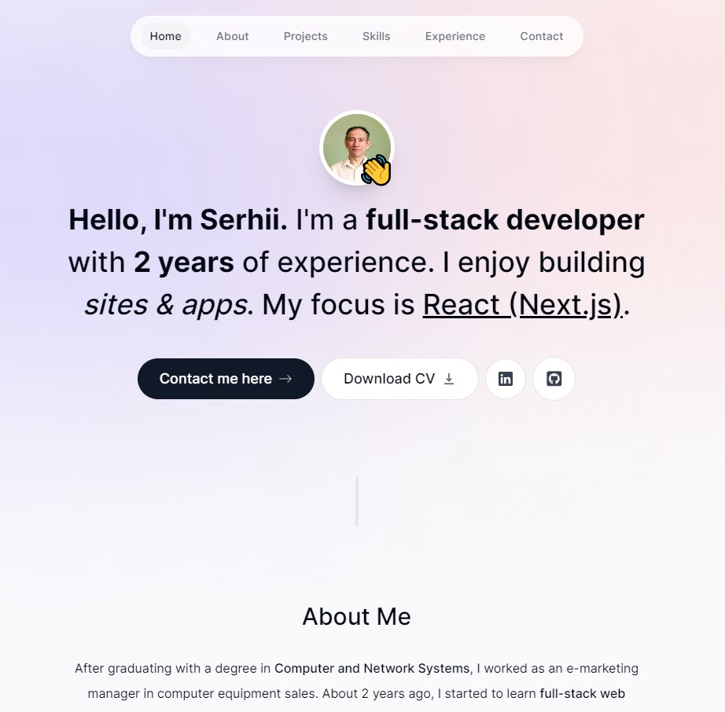

# Serhii Nezhyhai's Portfolio Website

## Introduction

Welcome to my portfolio website! This platform serves as a canvas to exhibit my skills, projects, and experiences as a [Your Profession or Field]. Take a moment to explore and discover more about me and my work.

🌐 Visit the live website at [https://serhii.vercel.app/](https://serhii.vercel.app/).

## Features

👤 **About Me:** Dive into my background, skills, and passions.

🚀 **Projects:** Discover a curated selection of my finest projects, complete with detailed descriptions.

📬 **Contact:** Reach out to me via email or through various platforms for inquiries or potential collaborations.

📄 **Resume:** Download my comprehensive resume to gain insights into my qualifications.

## Technologies Used

This website is powered by cutting-edge technologies and frameworks, including:

- 🚀 Next.js App Router
- 🏭 Next.js Server Actions
  🔄 Client & Server Components
  🧪 TypeScript (Beginner & Intermediate)
  🎨 Tailwind CSS
  🧩 Context API
  🎉 Advanced Animations with Framer Motion
  📧 React.Email & Resend
  🪝 Custom React Hooks
  🎨 Sleek, Modern UI Design
  🌓 Light & Dark Mode
  📱 Responsive Website Design

## Getting Started

If you're interested in running this website locally or customizing it for your own portfolio, follow these steps:

1. Open the project folder in your preferred code editor.
2. Customize the content in the HTML and CSS files to align with your personal information, projects, and stylistic preferences.
3. Add your own project images to the `img/projects` directory.
4. Test the website by opening the `index.html` file in your web browser.
5. Deploy the website to your chosen hosting platform (e.g., GitHub Pages, Netlify, Vercel).

## License

This project is licensed under the MIT License. See the [LICENSE](LICENSE) file for more details.

## Contact

Feel free to connect with me for any questions, suggestions, or potential collaborations:

## Contact

🌐 **Website:** [https://serhii.vercel.app/](https://serhii.vercel.app/)

🐙 **GitHub:** [github.com/sergio-nezhigay](https://github.com/sergio-nezhigay)

💼 **LinkedIn:** [linkedin.com/in/nezhigay-serhiy](https://linkedin.com/in/nezhigay-serhiy)

📧 **Email:** abc1971h@gmail.com

✈️ **Telegram:** [t.me/abc1971h](https://t.me/abc1971h)

Feel free to reach out if you have any job proposals, suggestions, or if you'd like to collaborate on a project!
